# Bitcoin Price Prediction

This project predicts **next-day Bitcoin price movement** using three approaches:
- **LSTM** sequence regression,
- **Transformer** sequence regression,
- **Naive Bayes** direction classification (**Up/Down**).

The goal is to compare deep learning and classical probabilistic modeling in terms of:
- **next-day price prediction quality**,
- **direction prediction quality**,
- **training stability**,
- **interpretability through visual analytics**.

## Quick Overview

- **Best regression model in current results:** LSTM
- **Alternative deep model:** Stabilized Transformer
- **Classification baseline:** Gaussian Naive Bayes
- **Main outputs:** saved models, JSON metrics, and plot-rich visual evaluation

## Project Workflow

1. Load raw historical BTC data.
2. Clean and standardize numerical values.
3. Engineer features (including MA_7, MA_30, RSI, date-based features, and volatility features).
4. Scale data and create time windows with sequence length 60.
5. Train models:
   - LSTM for price regression,
   - Stabilized Transformer for price regression,
   - Naive Bayes for direction classification.
6. Evaluate on held-out test data.
7. Save metrics as JSON and generate comparison plots.
8. Produce next-day forecasts with trend signals.

## Repository Structure

Simplified project file structure:

```text
bitcoin-price-prediction/
|-- data/
|   |-- raw/
|   |-- processed_data/
|   `-- preprocessing.py
|-- models/
|   |-- data_utils.py
|   |-- lstm_model.py
|   |-- transformer_model.py
|   |-- naive_bayes_model.py
|   `-- prediction_utils.py
|-- scripts/
|   |-- train_model_lstm.py
|   |-- train_model_transformer.py
|   `-- train_model_naive_bayes.py
|-- results/
|   |-- metrics/
|   `-- plots/
|-- saved_models/
`-- visualization/
```

## Libraries Used

| Category | Libraries | Usage |
| --- | --- | --- |
| Data and Numerical Computing | `numpy`, `pandas` | Numerical operations, tabular data processing, feature engineering |
| ML / DL | `tensorflow`, `keras`, `scikit-learn` | LSTM/Transformer training, preprocessing, metrics, cross-validation, GaussianNB |
| Visualization | `matplotlib`, `seaborn` | Training curves, trend plots, heatmaps, statistical analysis |
| Persistence and Utilities | `joblib`, `json`, `os`, `sys`, `warnings`, `re` | Saving artifacts, experiment tracking, utility operations |

## Models and Settings

### LSTM (price regression)
| Parameter | Value |
| --- | --- |
| Sequence length | 60 |
| Prediction horizon | 1 day |
| Epochs | 100 |
| Batch size | 16 |
| Input features | Open, High, Low, Volume, MA_7, MA_30, RSI |

### Stabilized Transformer (price regression)
| Parameter | Value |
| --- | --- |
| Sequence length | 60 |
| Prediction horizon | 1 day |
| Epochs | 100 |
| Batch size | 32 |
| Stabilization | BatchNormalization, reduced dropout, gradient clipping, conservative learning rate, reduced model complexity |

### Naive Bayes (direction classification)
| Parameter | Value |
| --- | --- |
| Model type | GaussianNB |
| Task | Direction classification (Down / Up) |
| Sequence length | 60 |
| Prediction horizon | 1 day |
| var_smoothing | 1e-09 |

## Results and Evaluation

Metrics are taken from:
- results/metrics/training_results.json
- results/metrics/transformer_results.json
- results/metrics/naive_bayes_results.json

### 1) LSTM - Regression (test)
| Metric | Value |
| --- | --- |
| MSE | **0.0029** |
| MAE | **0.0446** |
| RMSE | **0.0540** |
| R2 | **0.9006** |

**Conclusion:** LSTM gives the best regression quality in the current experiment set.

### 2) Stabilized Transformer - Regression (test)
| Metric | Value |
| --- | --- |
| MSE | **0.0072** |
| MAE | **0.0716** |
| RMSE | **0.0850** |
| R2 | **0.7534** |

**Conclusion:** Transformer training is stable, but test accuracy is lower than LSTM in this run.

### 3) Naive Bayes - Direction Classification (test)
| Global metric | Value |
| --- | --- |
| Accuracy | **0.7841** |
| Precision (weighted) | **0.7479** |
| Recall (weighted) | **0.7841** |
| F1-score (weighted) | **0.7149** |

| Class | Precision | Recall | F1 |
| --- | --- | --- | --- |
| Down | 0.6000 | 0.0857 | 0.1500 |
| Up | 0.7902 | 0.9837 | 0.8764 |

**Conclusion:** the model strongly detects upward moves but misses many downward moves (low recall for Down), which suggests class imbalance effects.

## Selected Plot Visualizations

### LSTM vs Transformer comparison
**Model metrics comparison (R2, MAE, MSE, RMSE):**

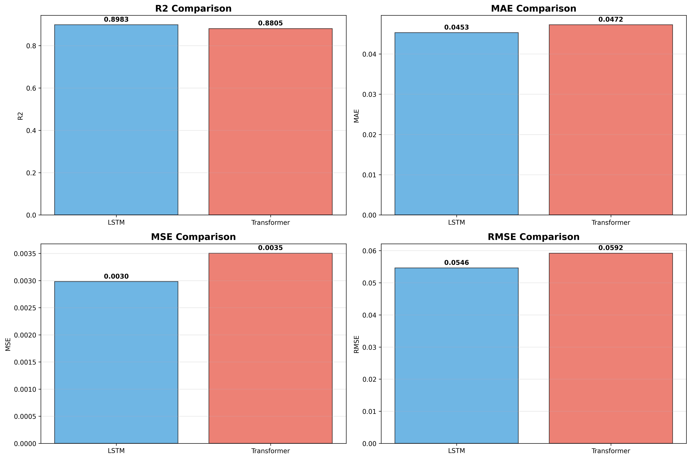

**LSTM training curves:**

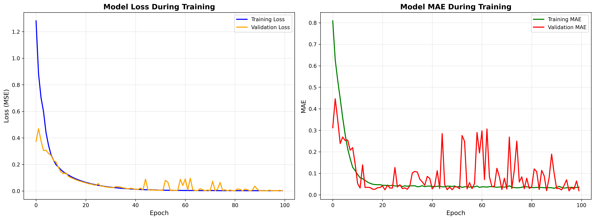

**Transformer training curves:**

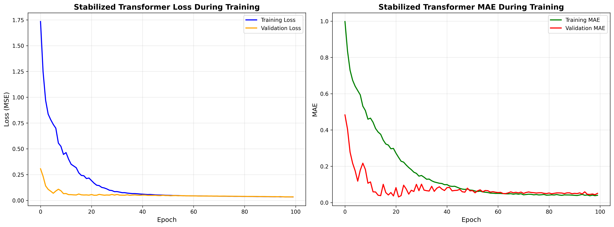

### Time-series analysis of BTC
**Price over time:**

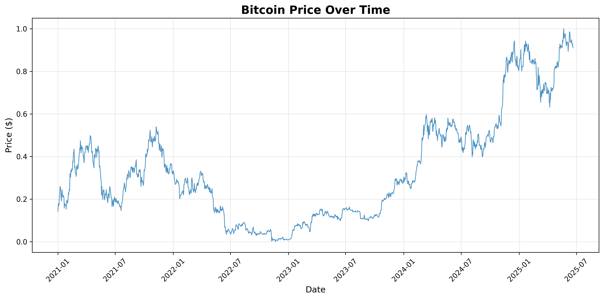

**Price with moving averages:**

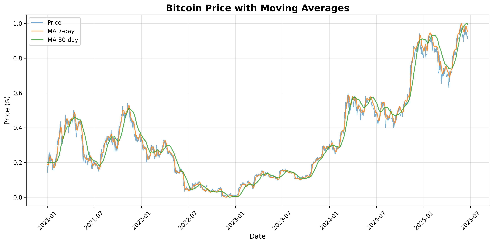

**Price distribution:**

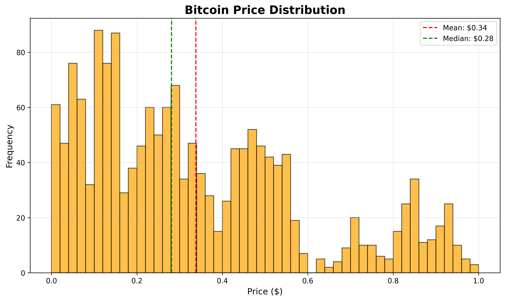

**Feature correlation matrix:**

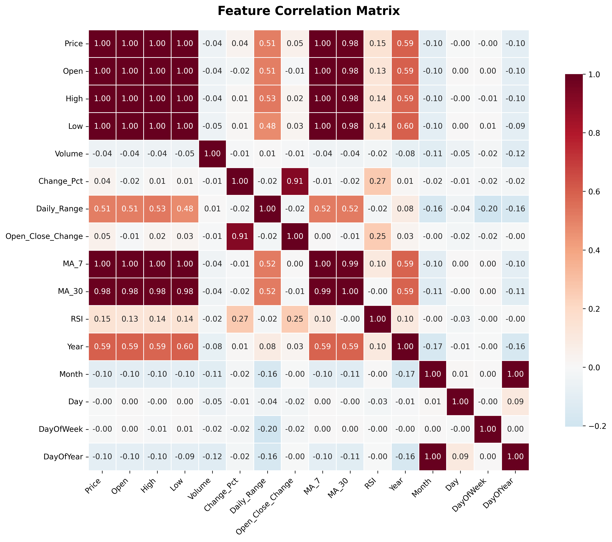

### Forecast example
**Single-day forecast visualization with uncertainty:**

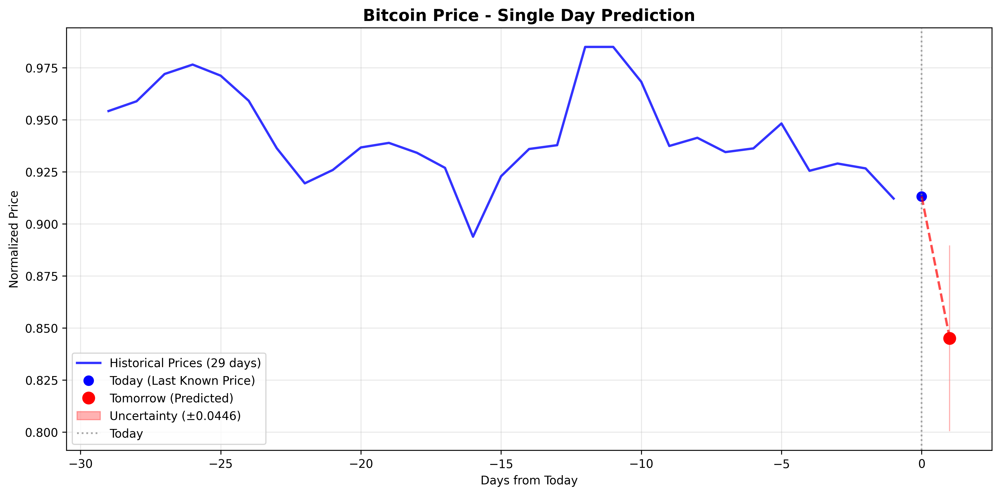

### Naive Bayes evaluation plots
**Main classification dashboard (confusion matrix, metrics, confidence distribution):**

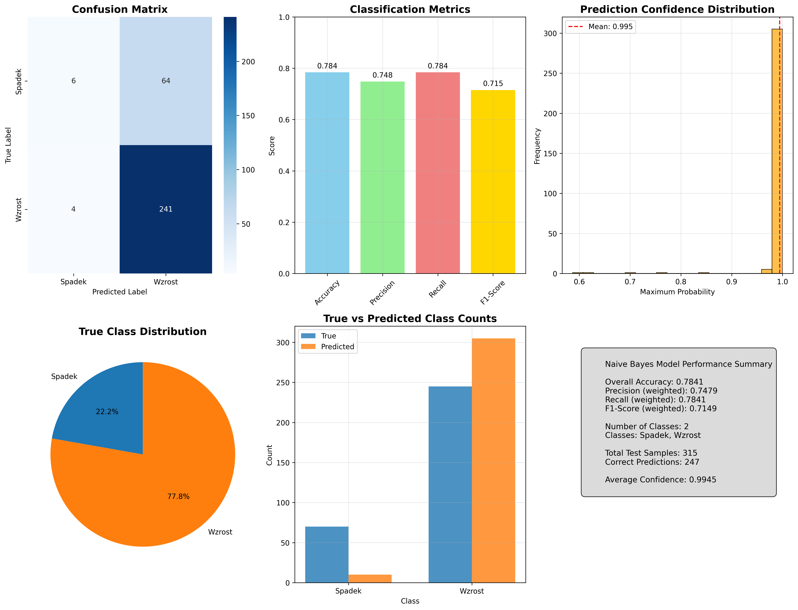

**Top feature variance analysis:**

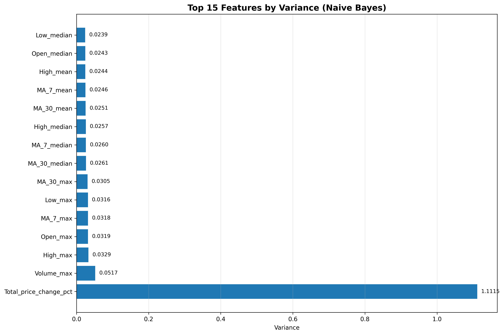

**Naive Bayes feature correlation matrix:**

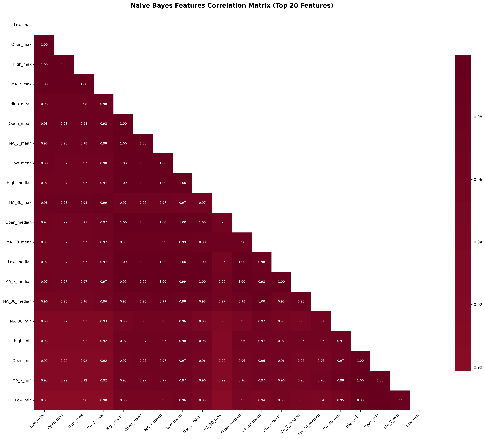

## Example Next-Day Predictions

Prediction scripts report:
- **predicted next-day price**,
- **absolute and percentage change**,
- **trend signal** (BULLISH/BEARISH),
- **signal strength and interpretation notes**.

Example outputs in this project include both bearish and bullish scenarios, which helps compare model behavior across different market conditions.

## How to Run

1. Prepare data:
   ```bash
   python data/preprocessing.py
   ```
2. Train a model:
   ```bash
   python scripts/train_model_lstm.py
   python scripts/train_model_transformer.py
   python scripts/train_model_naive_bayes.py
   ```
3. Generate visualizations:
   - run scripts from the `visualization/` folder

## Summary

- **Best regression performance in current metrics:** LSTM.
- **Transformer** offers stable training curves and a robust alternative baseline.
- **Naive Bayes** provides solid overall direction metrics but needs improvement for Down-class recall.
- The project includes complete artifacts: **JSON metrics**, **saved models**, and an extensive **plot set** for analysis.